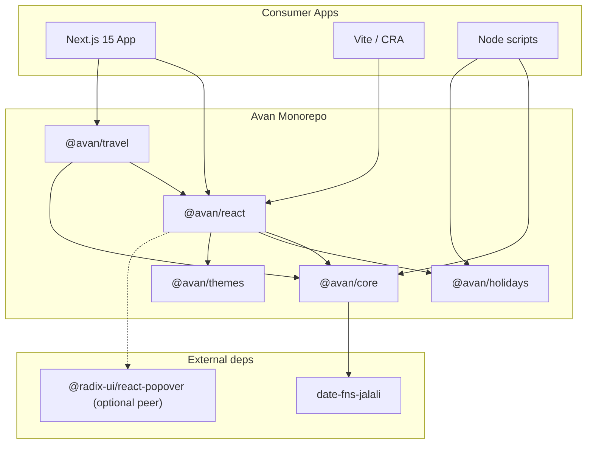

# Architecture — Avan Persian Date Picker

## System overview



## Package dependency rules

| Package          | May depend on          | Must NOT depend on |
| ---------------- | ---------------------- | ------------------ |
| `@avan/core`     | `date-fns-jalali`      | react, css         |
| `@avan/holidays` | `@avan/core`           | react              |
| `@avan/themes`   | — (CSS only)           | react              |
| `@avan/react`    | core, holidays, themes | —                  |
| `@avan/travel`   | core, react            | —                  |

**Rule:** Dependencies flow downward only. No circular imports.

## Data model

### Internal canonical type: `Date`

All component `value` / `onChange` props use **Gregorian `Date`** (UTC-normalized at local noon policy — document in core).

### Display type: `JalaliDate`

```ts
interface JalaliDate {
  year: number;
  month: number;
  day: number;
}
```

### Range with dual representation

```ts
interface AvanDateRange {
  from: Date | null;
  to: Date | null;
  meta?: {
    jalaliFrom?: JalaliDate;
    jalaliTo?: JalaliDate;
    nights?: number;
  };
}
```

## Calendar grid generation

```
getMonthGrid(year, month, options)
  → weeks: CalendarDay[][]
```

Each `CalendarDay` is computed deterministically from `@avan/core` — React only maps to JSX.

## State management (React)

`useAvanCalendar` holds:

- `visibleMonth: JalaliDate` — pagination
- `selection: SelectionState` — single | range | multiple
- `focusedDay: JalaliDate | null` — keyboard

Controlled vs uncontrolled:

- `value` + `onChange` → controlled (required for forms)
- `defaultValue` → uncontrolled

## Theming architecture

Three layers (outside-in):

1. **CSS variables** on `.Avan-root` (portable)
2. **`theme` prop** — inline override mapping to CSS vars
3. **`classes` prop** — Tailwind / CSS module slot overrides

No CSS-in-JS runtime (keeps RSC bundle clean).

## SSR / hydration

| Concern         | Strategy                                            |
| --------------- | --------------------------------------------------- |
| Initial month   | Accept `defaultMonth` prop from server              |
| Today highlight | Client-only after mount OR pass `today` from server |
| Popover         | Client-only; no SSR of open state                   |
| Locale          | Pass via context from server-rendered layout        |

## File structure (monorepo)

```
Avan-persian-date-picker/
├── packages/
│   ├── core/
│   ├── holidays/
│   ├── react/
│   ├── travel/
│   └── themes/
├── apps/
│   ├── storybook/
│   └── docs/              # Phase 6
├── examples/
│   └── nextjs-app-router/
├── documentation/         # Markdown guides
├── package.json
├── pnpm-workspace.yaml
└── turbo.json
```

## Public API surface (stable)

### `@avan/core`

- `toJalali(date): JalaliDate`
- `toGregorian(jalali): Date`
- `formatJalali(date, pattern): string`
- `parseJalali(str): Date`
- `getMonthGrid(jy, jm, opts): CalendarDay[][]`

### `@avan/react`

- `AvanProvider`
- `AvanCalendar`
- `AvanDatePicker`
- `AvanDateRangePicker`
- `useAvanCalendar`

### `@avan/travel`

- `AvanTravelCalendar`
- `computeRangePrice`
- `createAvailabilityRules`

## Versioning

- **Independent packages** via Changesets
- Breaking core API → major bump on all dependent packages
- Holiday data: minor bump when adding new year file

## Security

- No `eval`, no `innerHTML` in day cells
- `renderDay` user content is consumer responsibility (document XSS)
- Holiday JSON validated by schema in CI
